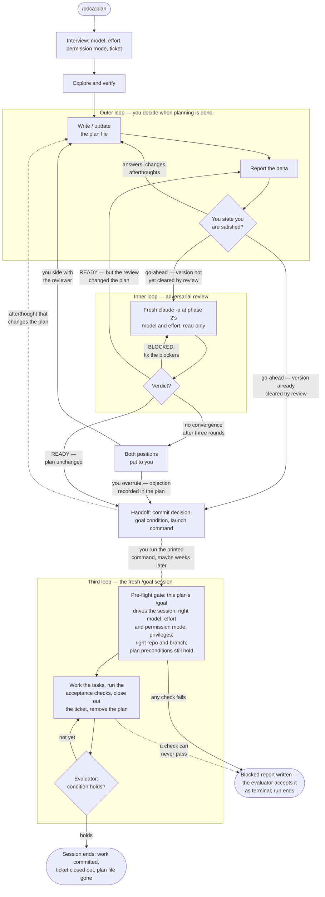

# pdca Plugin

Two-phase development harness for Claude Code: plan interactively, implement
autonomously.

## The idea

This is the Deming PDCA cycle with a session boundary in the middle.

| Phase | Session | What happens |
|-------|---------|--------------|
| **Plan** | interactive, with you | Explore, verify every assumption by running commands, and iterate on a plan file until you are satisfied |
| **Do / Check / Act** | fresh, unattended | A new `claude` process checks it is the session the plan was written for, implements the plan under `/goal`, and cannot stop until an evaluator agrees the work is done |

The plan file is the entire interface between them. Phase 2 has no memory of your
conversation — so the plan has to be good enough that nobody needs to babysit it.

## Usage

```
/pdca:plan opus high raise the staging cache TTL from five minutes to an hour
```

The leading `opus high` sets the model and effort level for the *second* phase.
Both are optional — if omitted you will be asked, in a short interview of
pick-an-option questions before planning starts, because how much the plan must
spell out depends on who will be reading it.

The interview also asks for a Jira ticket, every time — a key, a URL, or "none". Given one,
the session reads it before it plans anything and puts its requirements to you as a
list: this one is in scope, this one looks like a separate ticket, this acceptance
criterion is not testable as written — here is what I propose instead. A ticket is a
request, not a specification: the plan is allowed to come out different from it, and
usually does in the non-functional half — the named mechanism, the suggested library,
the split into phases, the performance number someone wrote down before anything was
verified. Phase 1 is where things get verified, so those get challenged with evidence.
Every decision is yours; not the ticket author's and not the model's. What you decide
goes into the plan as a requirements table, including the requirements you dropped, so
the autonomous phase does not helpfully implement them behind your back.

Planning then proceeds interactively. Each turn updates
`docs/plans/<date>-<slug>.md` and reports only what changed; you read the file when
you want the whole picture. When you are satisfied, the plan is handed to a fresh
`claude -p` process running at phase 2's model and effort — which sees the plan and
the repository and nothing else — and asked whether it could execute it unattended.
Blockers get fixed and it is asked again, up to three rounds. If fixing them changed
the plan, the changes come back to you before anything else happens — your go-ahead
was given to a version the review has since rewritten. Afterthoughts at that point
reopen the iteration, and a materially changed plan goes through review again. The
two loops alternate until a single version of the plan is one that all three parties
stand behind: you, the planning session, and the model that will execute it — or, if
the review will not converge, until you settle the disagreement yourself: you
outrank both models, and the overruled objection is recorded in the plan. Only then
does the session write the launch command into the plan, print it, and — if you
agreed — commit the plan:

```bash
claude --model opus --effort high --permission-mode auto '/goal Execute the plan at …'
```

Run that in the work repository's directory — usually the same one you planned in —
and the autonomous phase begins with a pre-flight check. Before it changes anything,
it confirms a `/goal` naming this plan is what is driving it — a launch that lost
the prefix runs with no evaluator guarding its completion, so it can stop half-done
and nobody notices — that it is running on the model, effort level and permission
mode the plan was written for, that every privilege the plan needs is actually
available — a passwordless sudo, a warm signing key, a cluster role — and that it
is in the right repository on the right branch. If any of that is wrong it writes
a `.BLOCKED.md` naming the mismatch and stops immediately, rather than producing
plausible-looking work on the wrong model and going wrong somewhere nobody is
watching.

Past the gate, it ticks off tasks in the plan file as it goes, so you can watch
progress by reading the file — and an interrupted run resumes from where it stopped. When every acceptance check passes,
it commits the work on the current branch and deletes the plan file in the same
commit.

If the plan names a ticket, one thing happens first. The plan file is the record of the
whole run — every ticked box, every decision the session made alone — and it is about to
be deleted, so its final state is committed on its own and pushed, and a comment goes up
on the ticket linking to the plan **at that commit**, plus the outcome: what was done, the
commits, each acceptance check with its result, and which ticket requirements this run
deliberately did not cover. Only then is the file removed, in a separate follow-up commit
— which is what keeps the linked commit the last one where the plan still exists. Jira
cannot hold the file itself (no attachment upload, no way to link it from the issue), so
git holds the artifact and the ticket holds the URL. If the commit, the push or the
comment cannot be made, the plan stays where it is and the run stops with a blocked
report — nothing is deleted before its replacement exists at an address that resolves.

That is also why naming a ticket means the plan gets committed: with a ticket it is not
the optional convenience it is otherwise, it is the preservation mechanism, so the
planning session commits it without asking.

The closeout commits and comments, and does nothing else: it will not transition your
ticket, reassign it, or edit its fields. And it happens without asking — naming the
ticket at the start was the decision, and neither phase brings it back to you.

If a check turns out to be impossible, it writes a `.BLOCKED.md` post-mortem and
stops, rather than retrying forever.

## The three loops

The harness is three loops in total. The planning session nests the first two: you
drive the outer one, and it exits only when you *state* you are satisfied — never by
inference, and never in the same turn as the first draft; the adversarial reviewer
drives the inner one. A plan reaches the handoff only when a single version of it is
one that all three parties stand behind at once — you, the planning session, and the
model that will execute it. The one exception is your override: a review that will
not converge is settled by you, and your settlement is the exit, with the overruled
objection recorded in the plan. The third loop is `/goal` itself: in the fresh session,
an evaluator judges the goal condition after every turn and blocks stopping until it
holds — or until the session proves it cannot, in the blocked report.



Only a READY on a plan the review did not touch exits straight to the handoff — that
version is exactly the one you already approved. Any other path puts the plan back in
front of someone before it can leave the nest. The third loop then has exactly two
exits: the condition holds, or the blocked report says why it never can — and the
evaluator accepting that report as terminal is what lets the session stop.

## Coming back to a plan later

The gap between the two phases can be weeks, so the handoff command is never only
terminal output. It is written into the plan's own `## Handoff` section before being
printed, and — if you agreed to commit it — the plan is committed, so the command
survives in the file, in the diff, and in `git log`.

If the plan has been sitting a while, reopen it rather than pasting the old command:

```
/pdca:plan docs/plans/2026-08-27-cache-ttl.md
```

Because every fact in the plan's Verified Context is recorded with the command that
established it, re-verification is cheap: the session re-runs them, tells you what
has drifted since, brings the plan back to true, takes it back through the review,
and reprints a fresh handoff.

And if a stale plan gets executed anyway, the executing session is told to check the
Verified Context against reality before it starts, and to stop with a blocked report
if the ground has moved.

## Requirements

`/goal` needs a trusted workspace and working hooks — it is unavailable when
`disableAllHooks` or `allowManagedHooksOnly` is set.

The ticket side is optional and degrades cleanly. Reading a ticket needs an Atlassian
MCP server, a CLI, or you pasting it. The closeout needs a comment channel — the MCP
server is enough — plus a repository whose web host has a permalink form the planning
session can work out and prove by handing you a URL to click. If there is no comment
channel it tells you before the handoff and asks which fallback you want: supply an API
token, or keep the preservation commit and drop the comment. If there is no remote at
all, the comment carries the commit SHA and a `git show` line instead of a link. What it
will not do is promise a link the autonomous run cannot deliver.
