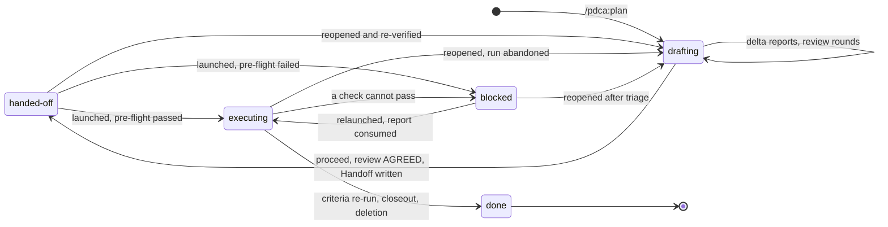
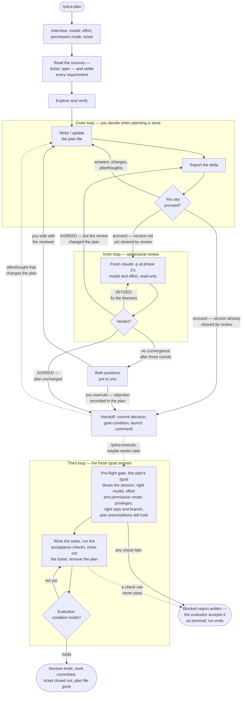

# pdca Plugin

Two-phase development harness for Claude Code: plan interactively, execute
autonomously.

## The idea

This is the Deming PDCA cycle with a session boundary in the middle.

| Phase | Session | What happens |
|-------|---------|--------------|
| **Plan** — the planning phase | interactive, with you | Explore, verify every assumption by running commands, and iterate on a plan file until you say proceed |
| **Do / Check / Act** — the execution phase | fresh, unattended | A new `claude` process checks it is the session the plan was written for, executes the plan under `/goal`, and cannot stop until an evaluator agrees the work is done |

The plan file is the entire interface between them. Phase 2 has no memory of your
conversation — so the plan has to be good enough that nobody needs to babysit it.

## Usage

```
/pdca:plan opus high raise the staging cache TTL from five minutes to an hour
```

The leading `opus high` sets the model and effort level for the *second* phase.
Both are optional — if omitted you will be asked, in a short interview of
pick-an-option questions before planning starts, because how much the plan must
spell out depends on who will be reading it.

The interview also asks for a Jira ticket, every time — a key, a URL, or "none". A
spec is the other kind of input: hand it over on the command line —
`/pdca:plan opus high docs/specs/cache-ttl.md` — or as a URL, or paste it. Ticket and
spec are both **requirements sources**, and given either, the session reads it before
it plans anything and puts its requirements to you as one list: this one is in scope,
this one looks like a separate ticket, this acceptance criterion is not testable as
written — here is what I propose instead. A source is a request, not a contract, even
one titled "specification": the plan is allowed to come out different from it, and
usually does in the non-functional half — the named mechanism, the suggested library,
the split into phases, the performance number someone wrote down before anything was
verified. Phase 1 is where things get verified, so those get challenged with evidence.
Every decision is yours; not the source's author's and not the model's. What you
decide goes into the plan as a requirements table naming every source, including the
requirements you dropped, so the execution phase does not helpfully implement
them behind your back.

Planning then proceeds interactively. Each turn updates `<date>-<slug>-plan.md` — at
the repository root, never tucked under `docs/` — and reports only what changed; you
read the file when you want the whole picture. When you say proceed, the plan is
handed to a fresh `claude -p` process running at phase 2's model and effort — which
sees the plan and the repository and nothing else — and asked whether it could
execute it unattended.
Its verdict is one word: VETOED, with at least one blocker to fix, after which it is
asked again, up to three rounds; or AGREED, possibly with nits, which are applied
without another round. If the review changed the plan, the changes come back to you
before anything else happens — your proceed
was given to a version the review has since rewritten. Afterthoughts at that point
reopen the iteration, and a materially changed plan goes through review again. The
two loops alternate until a single version of the plan is one that all three parties
stand behind: you, the planning session, and the model that will execute it — or, if
the review will not converge, until you settle the disagreement yourself: you
outrank both models, and the overruled objection is recorded in the plan. Only then
does the session write the launch command into the plan, print it, and commit the
plan:

```bash
claude --model opus --effort high --permission-mode auto --remote-control 2026-08-27-cache-ttl-plan '/goal Execute the plan at …'
```

You do not paste that. `/pdca:execute <plan>` — from any session, the planning one
included — runs it as a detached background process and hands you the id for
`claude attach`, `claude logs` and `claude stop`. The session comes up with Remote
Control on and named after the plan, so you can follow it from claude.ai or the mobile
app while it runs — read along, send it a message, stop it with `/goal clear` —
without being at the machine it runs on; only the machine has to stay up. The command
stays in the plan for a human to run by hand in the work repository's directory, where
the terminal then has to stay open. Either way the execution phase begins with a
pre-flight check. Before it changes anything,
it confirms a `/goal` naming this plan is what is driving it — a launch that lost
the prefix runs with no evaluator guarding its completion, so it can stop half-done
and nobody notices — that it is running on the model, effort level and permission
mode the plan was written for, that every privilege the plan needs is actually
available — a passwordless sudo, a cluster role, a live token — and that it
is in the right repository on the right branch. If any of that is wrong it writes
a `.BLOCKED.md` naming the mismatch and stops immediately, rather than producing
plausible-looking work on the wrong model and going wrong somewhere nobody is
watching.

Past the gate, it ticks off tasks in the plan file and commits the work as it goes, a
task or a coherent slice per commit, so you can watch progress by reading the file or
the log — and an interrupted run resumes from where it stopped. When every acceptance
check passes, it commits the plan's final state on its own — the preservation commit, the record of the run: every ticked box, every decision
the session made alone — and then removes the plan in a separate follow-up commit, so
the record stays the last commit in which the file exists.

If the plan names a ticket, one thing happens between those two commits. The
preservation commit is pushed, and a comment goes up on the ticket linking to the plan
**at that commit**, plus the outcome: what was done, the commits, each acceptance check
with its result, and which ticket requirements this run deliberately did not cover. Jira
cannot hold the file itself (no attachment upload, no way to link it from the issue), so
git holds the artifact and the ticket holds the URL. If the commit, the push or the
comment cannot be made, the plan stays where it is and the run stops with a blocked
report — nothing is deleted before its replacement exists at an address that resolves.

The plan is always committed — at handoff by the planning session, in its final state
by the execution session. Git is a requirement of this plugin, not an option, and the
planning session checks for a repository before it writes anything. The work goes on
the branch you planned on; if you want it on a new branch, say so, and the planning
session creates it at handoff so the plan lands there. The execution session never
creates branches.

The closeout commits and comments, and does nothing else: it will not transition your
ticket, reassign it, or edit its fields. And it happens without asking — naming the
ticket at the start was the decision, and neither phase brings it back to you.

If a check turns out to be impossible, it writes a `.BLOCKED.md` report next to the
plan, commits the two together, and stops, rather than retrying forever. The report
lists the working tree it leaves behind, and its frontmatter carries `next: relaunch`
or `next: reopen`. It is a message, not the record: whichever session picks the plan up
next — a relaunch's pre-flight or a reopen — folds it into the plan's Run Log and
deletes it, so a finished run never leaves one behind. And a leftover report cannot
end a relaunch early, because the goal only accepts a report written in that session.

## The plan file

Every plan opens with YAML frontmatter — the file's data, rendered by GitHub as a
table at the top — and the prose sections follow. The frontmatter says which plugin
version wrote the plan and when, which model, effort and permission mode it was
written for, which sources it was planned from, which ticket in which tracker it closes
out, where the file lives, and its `status`. Its keys are in alphabetical order, nested
ones too, so two plans differ only where they mean to. The status is the one piece of
state the file carries, and it is moved by whichever phase moves the plan:



`done` is written immediately before the preservation commit, so the permalinked final
state of a ticketed plan says so; the file is then deleted. A plan found on disk with
any other status says exactly what to do with it — see "Coming back to a plan later".

## The three loops

The harness is three loops in total. The planning session nests the first two: you
drive the outer one, and it exits only when you *say* proceed — never by inference,
and never in the same turn as the first draft; the adversarial reviewer
drives the inner one. A plan reaches the handoff only when a single version of it is
one that all three parties stand behind at once — you, the planning session, and the
model that will execute it. The one exception is your override: a review that will
not converge is settled by you, and your settlement is the exit, with the overruled
objection recorded in the plan. The third loop is `/goal` itself: in the execution session,
an evaluator judges the goal condition after every turn and blocks stopping until it
holds — or until the session proves it cannot, in the blocked report.



Only an AGREED on a plan the review did not touch exits straight to the handoff — that
version is exactly the one you already said proceed on. Any other path puts the plan back in
front of someone before it can leave the nest. The third loop then has exactly two
exits: the condition holds, or the blocked report says why it never can — and the
evaluator accepting that report as terminal is what lets the session stop.

## Coming back to a plan later

The gap between the two phases can be weeks, so the handoff command is never only
terminal output. It is written into the plan's own `## Handoff` section before being
printed, and the plan is committed, so the command survives in the file, in the diff,
and in `git log`.

If the plan has been sitting a while, reopen it rather than pasting the old command:

```
/pdca:plan 2026-08-27-cache-ttl-plan.md
```

The session reads the plan's `status` and acts on it rather than guessing from the
file's age. `drafting` continues where planning stopped. `handed-off` re-verifies:
because every fact in the plan's Verified Context is recorded with the command that
established it, that is cheap — the session re-runs them, re-reads the ticket and any
spec, tells you what has drifted since, brings the plan back to true — and a branch
made for it up to date with its base — takes it back through the review, and reprints
a fresh handoff. `blocked` reads the blocked report first, folds it into the Run Log,
deletes it, and then does the same. `executing` means a run is under way or was
interrupted, and the session asks before touching anything — relaunching with
`/pdca:execute` resumes the run from its ticked boxes; reopening abandons it.

And if a stale plan gets executed anyway, the execution session is told to check the
Verified Context against reality before it starts, and to stop with a blocked report
if the ground has moved.

## Launching a plan from its path

`/goal 2026-08-27-cache-ttl-plan.md` on its own does not work, however
self-sufficient the plan is, and the reason is the evaluator. It is Claude Code's small
fast model, it reads only the condition text and the transcript, and it calls no tools
— so a bare path gives it nothing to judge, it cannot open the file to find the
criteria, and the plan deletes itself before the last judgement anyway. The full
condition inlines the acceptance criteria so the evaluator holds them independently of
the session it is judging.

What does work is running the plan's own Handoff command, and `/pdca:execute` does
that:

```
/pdca:execute 2026-08-27-cache-ttl-plan.md
```

It reads the plan's `status` and acts on it — `handed-off` launches; `executing`, or
`blocked` with a report whose `next` is `relaunch`, resumes; `drafting` and
`next: reopen` send you to `/pdca:plan` — refuses to launch while a run is already
live in the repository, checks that the Handoff block is one `claude` command naming
this plan, and starts it with `claude --bg`, so the process is detached from your
terminal and you get an id back, plus the claude.ai link once Remote Control has
connected. It runs whatever the block says, including the `cd` form when the work
lives in another repository — which is fine, because the plan is a file you reviewed
and had reviewed.

The launch is always a new process, never work done in the session you type the
command into. Nothing inside a session can set a `/goal` — a command body that says
`/goal …` is just text to the model — and that session is not the one the plan was
written for anyway. The `execute` skill spells this out. If the plan has been sitting,
reopen it first; the launcher tells you how old the plan is and how far the branch has
moved since, but the freshness check is the reopen's job, not its own.

A finished run leaves its background session alive and idle; `claude agents` lists
them and `claude rm <id>` removes one.

For a session you started by hand with the right flags, the Handoff section also
carries a short form — one `/goal` line naming the plan, its protocol and the escape
hatch, but not the criteria. It is the fallback, and the plan says what it gives up.

## Watching phase 1 in the status line

Phase 2 shows its progress natively — `/goal` has a built-in `◎` indicator. Phase 1
can show its progress too, but Claude Code plugins cannot ship a status line, so this
part is an opt-in. The planning session maintains a one-line status file at
`~/.cache/claude-pdca/<session-id>.status` — the current step by name (`verify`,
`iterate`, `review 2/3`, `handoff`, …), updated at every step transition and review
round, deleted when planning ends — and your own status-line command displays it. Add a segment like this to the script your `statusLine` setting names:

```bash
# after: input=$(cat)
sid=$(echo "$input" | jq -r '.session_id // empty')
pdca_file="$HOME/.cache/claude-pdca/$sid.status"
if [ -n "$sid" ] && [ -f "$pdca_file" ]; then
  printf ' | PDCA %s' "$(head -c 120 "$pdca_file" | tr -d '[:cntrl:]')"
fi
```

No `refreshInterval` is needed: the status line re-runs on every assistant message,
which is exactly when the step changes. Without the segment, the file is still
written and is harmless — one tiny line per session, swept automatically after seven
days.

## Requirements

A git repository. The plan is committed at handoff and its final state is committed
again, on its own, before it is removed — git history is the run record — and the
planning session stops before writing anything if the working directory is not a
repository. A new branch for the work is made only if you ask for one, by the planning
session at handoff; the execution session never creates branches.

`/goal` needs a trusted workspace and working hooks — it is unavailable when
`disableAllHooks` or `allowManagedHooksOnly` is set.

Remote Control, which the execution session always starts with, needs a claude.ai
subscription login. With an API key, Bedrock or Vertex the session still starts and
does the work — it says at startup that Remote Control could not connect, and runs
unwatched. The planning session checks `claude auth status` and tells you which case
you are in.

The ticket side is optional and degrades cleanly. Reading a ticket needs an Atlassian
MCP server, a CLI, or you pasting it. The closeout needs a comment channel — the MCP
server is enough — plus a repository whose web host has a permalink form the planning
session can work out and prove by handing you a URL to click. If there is no comment
channel it tells you before the handoff and asks which fallback you want: supply an API
token, or keep the preservation commit and drop the comment. If there is no remote at
all, the comment carries the commit SHA and a `git show` line instead of a link. What it
will not do is promise a link the execution session cannot deliver.
